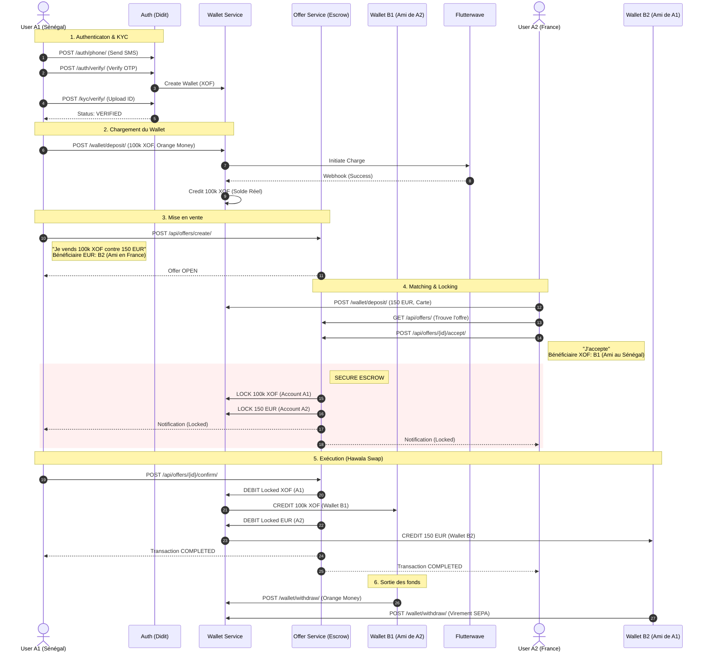

# Architecture Logique du Projet ALSABA

Voici le diagramme logique illustrant le flux complet d'une transaction, depuis l'inscription jusqu'à l'échange P2P final (Hawala).

## Légende des Endpoints Clés

| Phase | Endpoint | Description |
| :--- | :--- | :--- |
| **Auth** | `/api/accounts/auth/verify/` | Connexion & Token JWT |
| **Wallet** | `/api/wallet/deposit/` | Charger de l'argent réel dans le système |
| **Offer** | `/api/offers/create/` | Créer une annonce |
| **Offer** | `/api/offers/{id}/accept/` | **CRITIQUE** : Verrouille les fonds (Escrow) |
| **Offer** | `/api/offers/{id}/confirm/` | **CRITIQUE** : Exécute le swap vers les bénéficiaires |
| **Wallet** | `/api/wallet/withdraw/` | Récupérer l'argent vers le monde réel |
